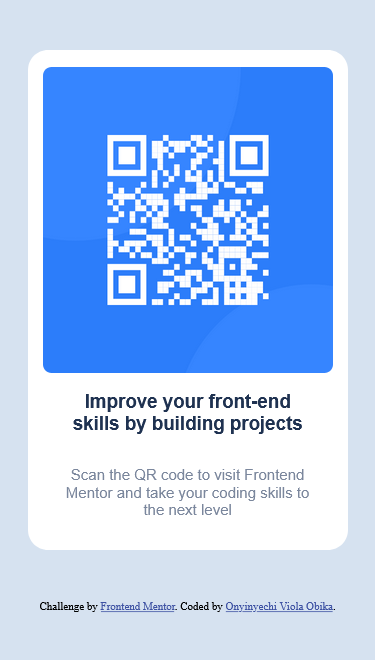
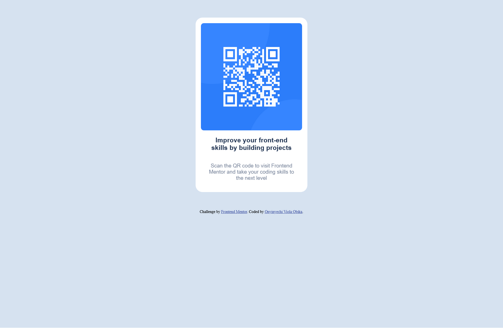

# Frontend Mentor - QR code component solution

This is a solution to the [QR code component challenge on Frontend Mentor](https://www.frontendmentor.io/challenges/qr-code-component-iux_sIO_H). Frontend Mentor challenges help you improve your coding skills by building realistic projects. 

## Table of contents

- [Overview](#overview)
  - [Screenshot](#screenshot)
  - [Links](#links)
- [My process](#my-process)
  - [Built with](#built-with)
  - [What I learned](#what-i-learned)
  - [Continued development](#continued-development)
- [Author](#author)
- [Acknowledgments](#acknowledgments)

**Note: Delete this note and update the table of contents based on what sections you keep.**

## Overview

Built a static qr code webpage which is a challenge from Frontend Mentor. This is my first challenge on Frontend and it turns out to be good. It is also the first time I will be using the flexbox concept to build a webpage.

### Screenshot

Here's a screenshot of the webpage built 
Mobile view (375 * 667)


Desktop view (1440 * 660)


### Links

- Solution URL: [Add solution URL here](https://github.com/Obikaviola/QR-code-challenge)
- Live Site URL: [Add live site URL here](https://qr-code-challenge-gold.vercel.app/)

## My process
To build this, I first made the root margin and padding to 0px, then styled the body and gave it display flex and als0 made the width and height of the body 100%. I moved on to styling the container which contained the qr code image, the header and the paragraph. Then I styled the rest of the elements.

### Built with

- Semantic HTML5 markup
- CSS custom properties
- Flexbox
- Google Fonts
- Mobile-first workflow 

### What I learned

I learnt how to link Google font to an html document using the link element.

```html
<link rel="preconnect" href="https://fonts.googleapis.com">
<link rel="preconnect" href="https://fonts.gstatic.com" crossorigin>
<link href="https://fonts.googleapis.com/css2?family=Outfit:wght@400;700&display=swap" rel="stylesheet">
```

I will also like to point out that this is the first time I am using flexbox for a project.

```css
body{
    background-color: hsl(212, 45%, 89%);
    height: 100%;
    width: 100%;
    display: flex;
    flex-direction: column;
    justify-content: center;
    align-items: center;
}
```

### Continued development

Being the first time of using the flexbox concept, I will like to learn more about it and try to build more webpages with it. I also will like to learn more about viewport width and viewport height though I did not use them for this challenge but it was suggested by [someone](slack profile) and probably incorporate it into the code later on. Using the Google fonts in this project is still a bit confusing to me but I am looking forward to practicing more on it.

## Author

- Frontend Mentor - [@Obikaviola](https://www.frontendmentor.io/profile/Obikaviola)
- Twitter - [@obika_viola](https://www.twitter.com/obika_viola)

## Acknowledgments

I will like to thank Grace on Frontend mentor slack community for the tips and [name]() whose solution had helped me solve the issues I had experienced 
